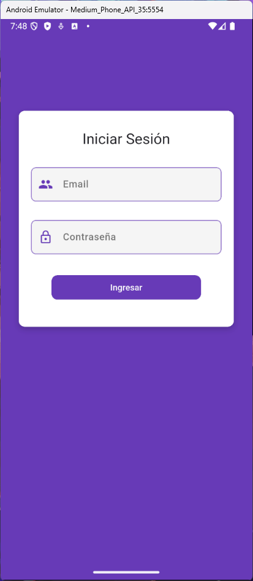

# Examen  
**Ramo:** Computación Móvil  
**Profesor:** René Alejandro Galarce  
**Alumno:** Elías Ignacio Muñoz González  

## Resumen  
Esta aplicación fue desarrollada como parte del examen del ramo Computación Móvil. Incluye un sistema de login con autenticación a través de Firebase. Además, permite visualizar y gestionar productos, categorías y proveedores, los cuales se obtienen desde una API externa.

## Tecnologías utilizadas  
- **Lenguaje:** Dart  
- **Framework:** Flutter  
- **Dependencias:**  
  - `flutter` (SDK)  
  - `http: ^1.2.2`  
  - `provider: ^6.1.2`  

## Capturas de pantalla  

  
  
  

